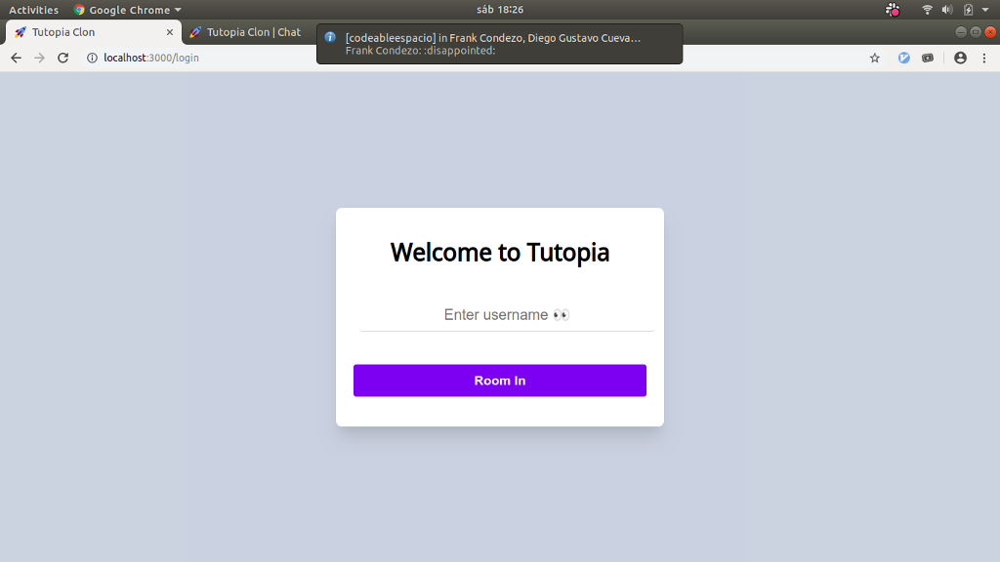
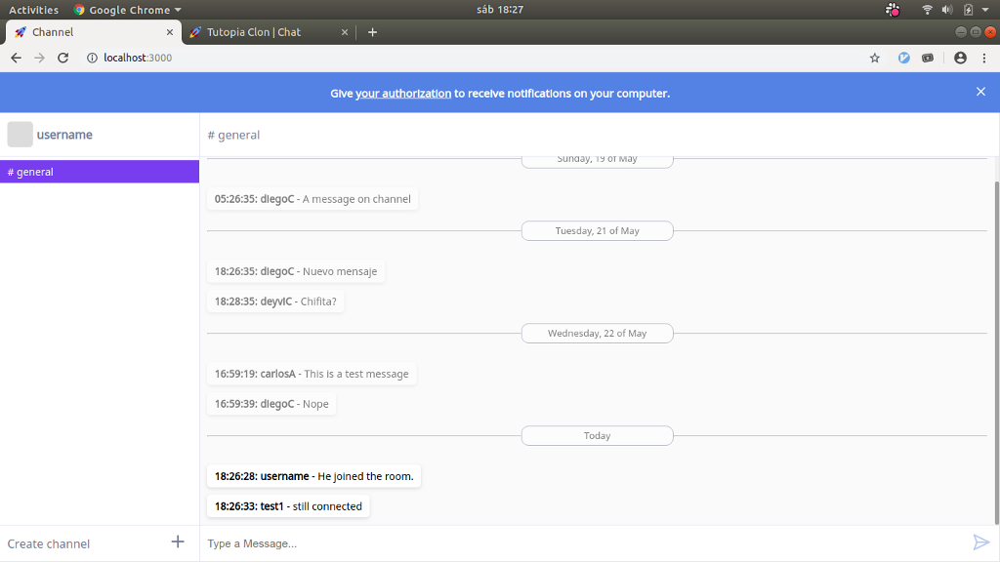
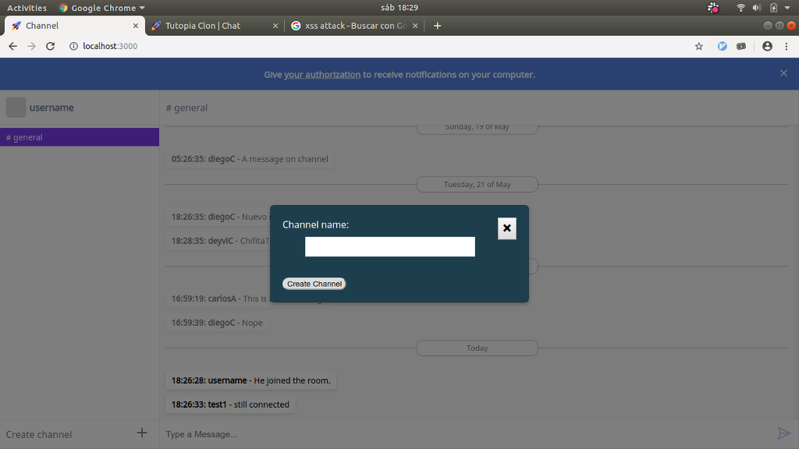
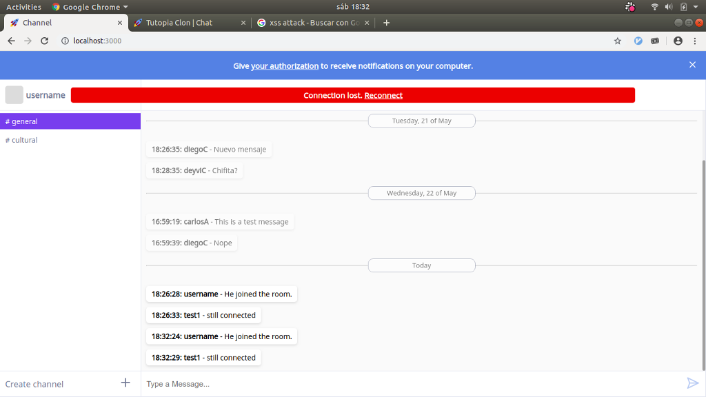
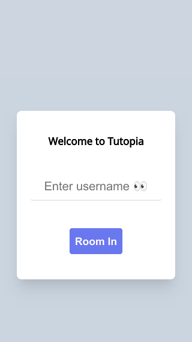
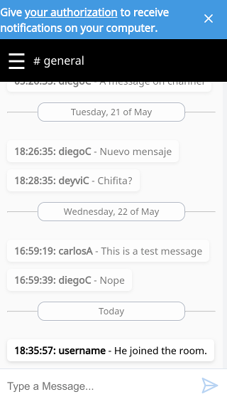
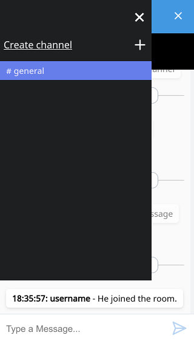
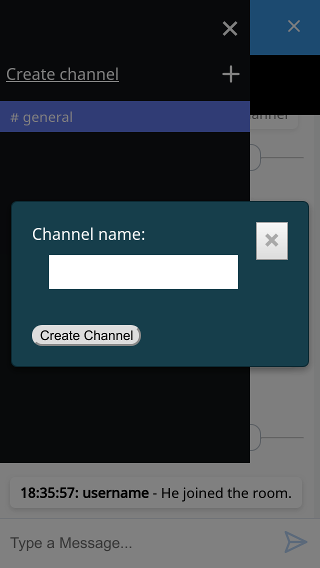
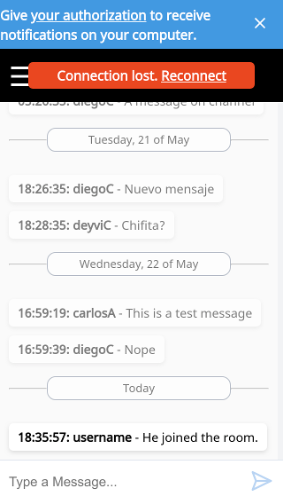

# JS Tutopía Clon

Create a multi channel chat application using the WebSocket server in [codeableorg/websocket-server](https://github.com/codeableorg/websocket-server) as your WebSocket server.

## Team

- Tech lead: Frank Condezo
- Member 1: Carlos Ayala
- Member 2: Diego Cuevas
- Member 3: Christopher Roa
- Member 4: Deyvi Conde

## Requirements

- [ ] The user should be asked for a username when trying to access.
  - [ ] The username should be stored for future usage if the user reload the page.
- [ ] After accessing the chat the user should be automatically joined to the `#general` channel.
- [ ] A user should have an option to change, and join, to another channel.
  - [ ] If the channel doesn't exists create one.
  - [ ] After the channel is created a message should be sent to the WebSocket server to notify other users. (_optional_)
- [ ] Previously accessed channels should be remembered after a page reload.
- [ ] Previously received messages should be remembered after a page reload.
  - [ ] Stored messages should be displayed with a disabled state after the user access the chat again. (_optional_)
- [ ] The user should receive notifications of new messages in the following conditions: (_optional_)
  - [ ] When a message is received on the non active channel and the page is visible. (_optional_)
  - [ ] When a message is received on the active channel and the page is not visible. (_optional_)
- [ ] A message must have a content, an author and the date.
- [ ] The date of a message should be displayed as only the hour with minutes.
- [ ] The messages should be grouped by date, without caring about the hour and minutes.
  - [ ] The grouped messages should have a visual separator with other groups. 
  - [ ] The current day should be displayed as `Today`. (_optional_)
  - [ ] The previous day should be displayed as `Yesterday`. (_optional_)

## Acceptance Criteria

- [ ] It must use semantic HTML
- [ ] It should not use JS libraries
- [ ] It must pass with green the Accessibility tests of the Chrome Audits
- [ ] It must pass with green the Best Practices tests of the Chrome Audits
- [ ] It must pass with green the SEO tests of the Chrome Audits
- [ ] The server code should not be modified in any way

## How it works

After downloading the application, prepare the software with:
```
npm install
```

next, execute:
```
npm start
```
then open your web browser with the following address:
```
http://localhost:3000/
```

Alternately, the application is available in Heroku, through this address:

```
https://devschat.herokuapp.com/
```


## Model:

Unique model transmitted through the websocket is message which is as follows:

```
message: {
  id: <timestamp>,
  user: <string>,
  content: <string>,
  channel: <string>
}
```

## Data stored in browser's localStorage:

|   key  |   value   |
|--------|-----------|
|`channels`|`["general"]`|
|`messages`|`[{"id":,"user":"username2","content":"Dummy message","channel":"general"}]`|
|`user`|`{"name": "username", "color":"rgb(218, 100,129)"}`|

## Views

### Desktop

Login screen


Channel screen


Creat channel screen


Lost connection screen


### Mobile

Login screen


Channel screen


Modal screen


Create channel screen


Los connection screen

